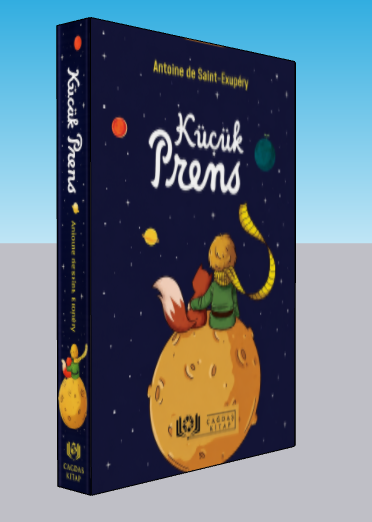
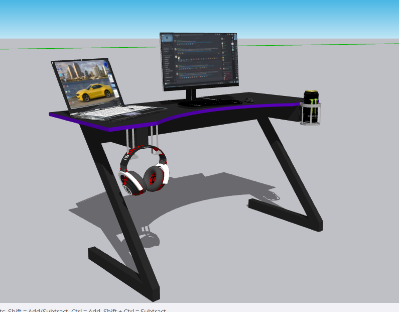

# My 3D Designs

A collection of original 3D models designed and created by **Enes Gülgen** using **SketchUp**.

This repository showcases my personal 3D design projects, including furniture, books, interior assets, and other original creations.

---

## 📦 Models

| Preview | Model | Download |
|:-------:|:------|:---------|
|  | **The Little Prince Book** | [View Model](Modeller/Book/kucukprens.skp) |
|  | **Gaming Desk** | [View Model](Modeller/OyuncuMasasi/link.txt) |
|  | **Modern TV Unit** | [View Model](Modeller/Unite/ünite.skp) |

---

## 📁 Repository Structure

```
Modeller/
├── Kitap/
├── OyuncuMasasi/
└── L-Ünite/

Resimler/
├── Kitap/
├── OyuncuMasasi/
└── L-Ünite/

README.md
```

---

## 🛠 Software

- SketchUp

---

## 👤 Author

**Enes Gülgen**

---

## 📄 Copyright

> All 3D models, renders, textures, and other assets contained in this repository are original works created by **Enes Gülgen**.
>
> These files are published exclusively for **portfolio and viewing purposes**.
>
> Copying, modifying, redistributing, or using any content from this repository without prior written permission is strictly prohibited.

© 2026 Enes Gülgen. All Rights Reserved.
